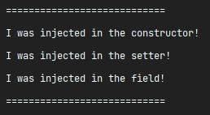
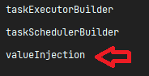
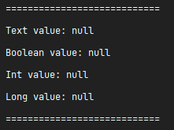
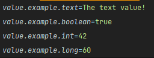
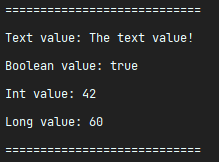

# Dependency Injection

In this exercise, we'll put in practice what we've learned about dependency injection.

##

## Task 1

In this task we are to create the dependencies to be injected.

We have the following interfaces:

`ConstructorInjected`, `FieldInjected` and `SetterInjected`. Then we have a class called
`ComponentWithDependencies`, that has dependency to all the aforementioned interfaces.

The `ComponentWithDependencies` has a method marked with the `@PostConstruct` annotation. Note that
the `@PostConstruct` is not a Spring annotation, but a **Java EE** annotation. It is recognized by
Spring though, and Spring calls methods annotated with @PostConstruct only once, just after the
initialization of bean properties.

Your task here is to create concrete classes of each interface dependency, and then inject them
into `ComponentWithDependencies`. As the names suggest, you should inject the dependency differently
for each of them:

- `ConstructorInjected` should be injected in `ComponentWithDependencies`'s constructor;
- `FieldInjected` should be injected directly in the field;
- `SetterInjected` should be injected with a setter method.

The implementation's `text()` method should just return simple messages:

- `ConstructorInjected`: `I was injected in the constructor!`
- `FieldInjected`: `I was injected in the field!`
- `SetterInjected`: `I was injected in the setter!`

Now if you go to the `AppConfig` class, you'll see a couple of things in there. This class creates a
bean of each of our aforementioned interfaces and classes. The first one being a bean of
type `ComponentWithDependencies`. Note that it receives both the `ConstructorInjected` and
`SetterInjected` as dependencies, and tries to set each of them in their respective places:

```java
@Bean
public ComponentWithDependencies componentWithDependencies(
    ConstructorInjected constructorInjected,SetterInjected setterInjected){
    //creates the instance injecting the constructor dependency
    ComponentWithDependencies componentWithDependencies=
    new ComponentWithDependencies(constructorInjected);

    //injects the setter dependency with the set
    componentWithDependencies.setSetterInjected(setterInjected);

    //the field dependency is injected with reflection, so we don't have to worry about it
    return componentWithDependencies;
    }
```

If everything is done correctly, this block of code shouldn't be giving any error afterwards.

Afterwards, we have a bean declaration for each of the interfaces: `ConstructorInjected`,
`SetterInjected` and `FieldInjected`. You should set the return value to be an instance of the
concrete implementation class you created.

If you did everything right, you should get the following output on your console:



Also check the list of beans in our application context. You should be able to find
`constructorInjected`, `fieldInjected` and `setterInjected` on the list.

##

## Task 2

For the next task, we'll be exploring the `@Value` annotation to inject some property values.

You'll be doing everything from scratch.

First, create an **interface** called `ValueInjection`. Create a concrete class that implements it,
then go ahead and add it to the beans pool by declaring it in our configuration class `AppConfig` (
the same way it is done for the other beans).

Run the application and make sure you can see your class in the beans pool:



Now, add some methods to the `ValueInjection` interface:

```java
    String getText();

    Boolean getBool();

    Integer getInt();

    Long getLong();
```

...and implement those in your concrete class. Also add **fields** to your concrete class, one for
each of the above values, and make the concrete methods return the value of those fields.

```java
    private String text;

//...
@Override
public String getText(){
    return text;
    }

//...
```

Ok! Now add the following block of code to your **concrete** implementation of the
`ValueInjection` interface:

```java
@PostConstruct
public void postConstruct(){
    System.out.println();
    System.out.println("============================");
    System.out.println("Text value: "+getText());
    System.out.println("Boolean value: "+getBool());
    System.out.println("Int value: "+getInt());
    System.out.println("Long value: "+getLong());
    System.out.println("============================");
    System.out.println();
    }
```

This will then be executed once the bean has been created, and will try to print the values.

If you run the application now, you should be getting:



...because we're not yet **injecting** those values. So let's do it! Now, using the `@Value`
annotation, inject the fields. For simplicity, you can use only **field injection**, but keep in
mind that, in a real code, **field injection** should be avoided.

Head to your `application.properties` file, under the `resources` folder. Create properties for each
of the values that we'll be using. Put whatever data you want! An example can be:



Now, put the property name inside the `@Value` annotation, and it should work!

> **Hint:** Don't forget the property name should use the `${property.name}` syntax! That's how
> spring compiles the text and recognizes you're trying to get the value from the property file,
> instead of just putting plain text.

If everything was done right, you should get a working output:

